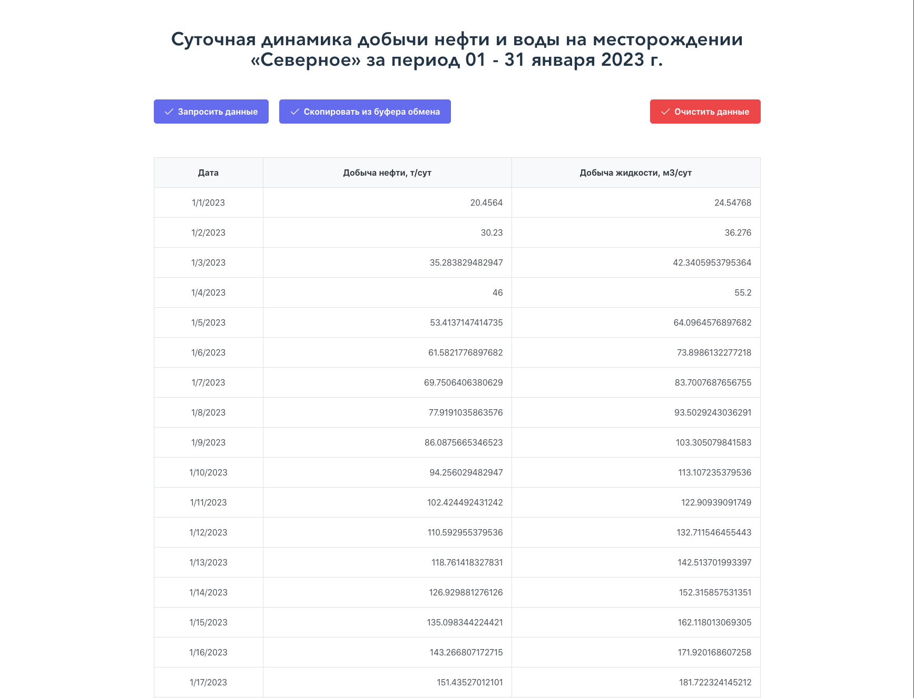

# Тестовое задание - приложение, отображающее таблицу с суточной динамикой добычи нефти
# 

> Пример использования приложения.

## Описание

Это приложение **Severnoe** создано рамках выполнения тестового задания. Исполнено для работы в браузере. Оно отображает таблицу с суточной динамикой добычи нефти (т/сут) и воды (м3/сут) на месторождении «Северное» за период 01 – 31 января 2023 г.

Данные можно загрузить:
- путем запроса по REST API;
- копированием данных из таблицы Excel;
  - либо нажатием на клавиатуре сочетания клавиш Ctrl-V;
  - либо нажатием кнопки "Скопировать из буфера обмена".

Также можно очистить ранее загруженные данные.
При рефреше страницы данные сохраняются.

## Использованные технологии:

- [React](https://ru.reactjs.org/)
- [Vite](https://vitejs.dev/)
- [ESLint](https://eslint.org/)
- [Prettier](https://prettier.io/)
- [PrimeReact](https://primereact.org/)
- [Redux Toolkit](https://redux-toolkit.js.org/)

## Начало работы

Склонируйте репозиторий (сделайте локальную копию) и выполните следующие простые шаги.

### Установка

1. Скачайте или склонируйте репозиторий
2. Перейдите в корневой директорию проекта
3. Установите зависимости:

- `npm install` или `yarn`

## Скрипты

### Запустить dev server

- `npm run dev` или `yarn run dev` и откройте в браузере `http://localhost:5173`

### Запустить линтер:

- `npm run lint` или `yarn lint`

### Запустить prettier:

- `npm run fix:prettier` или `yarn fix:prettier`

## Идеи для улучшения:
- внедрение интернационализации
- добавление тестов
- редактирование отдельных ячеек
